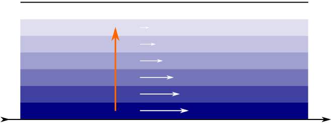
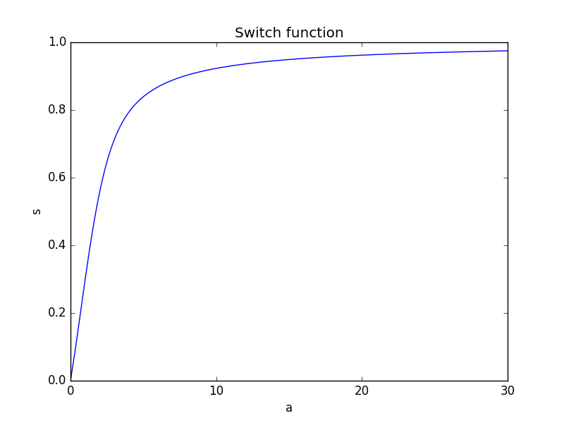
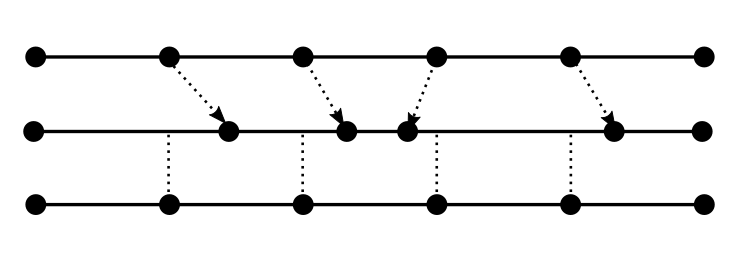
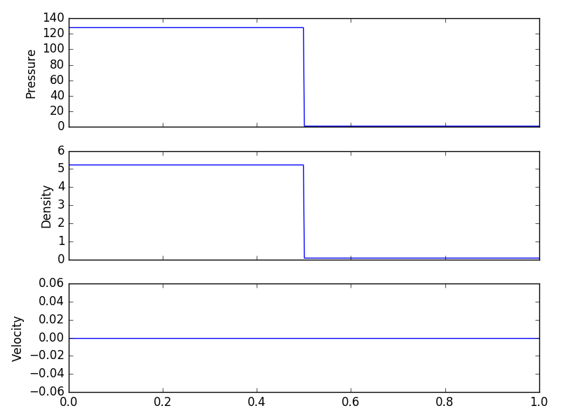
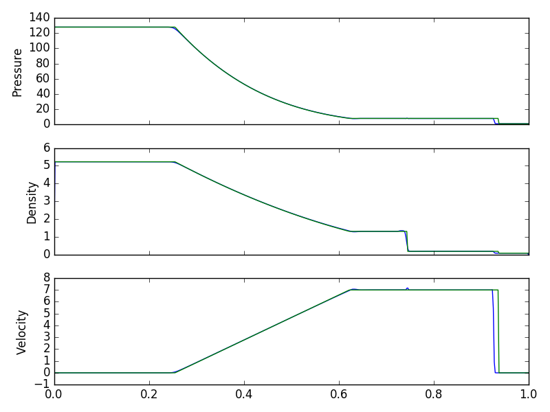
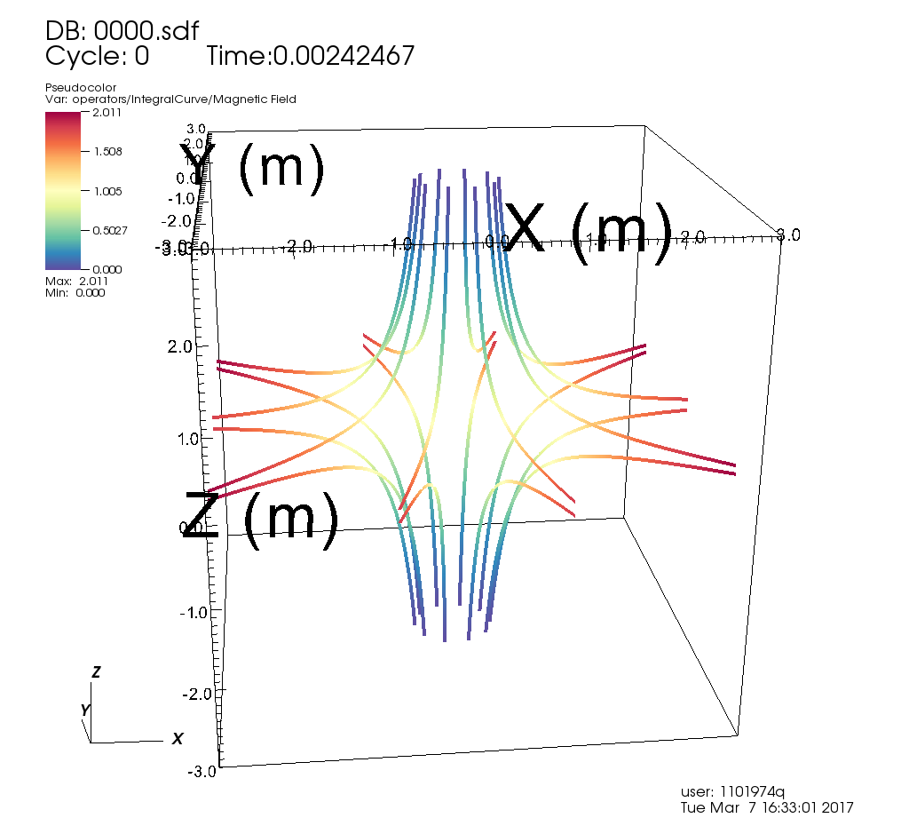
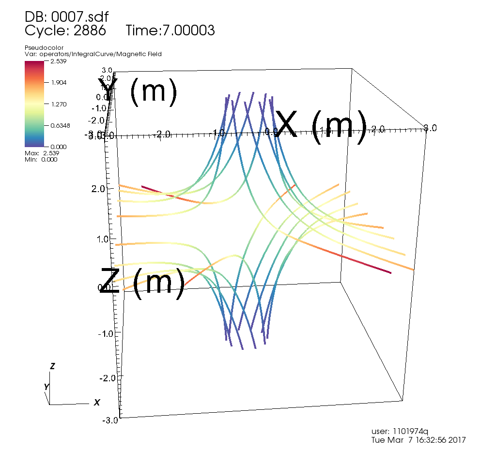
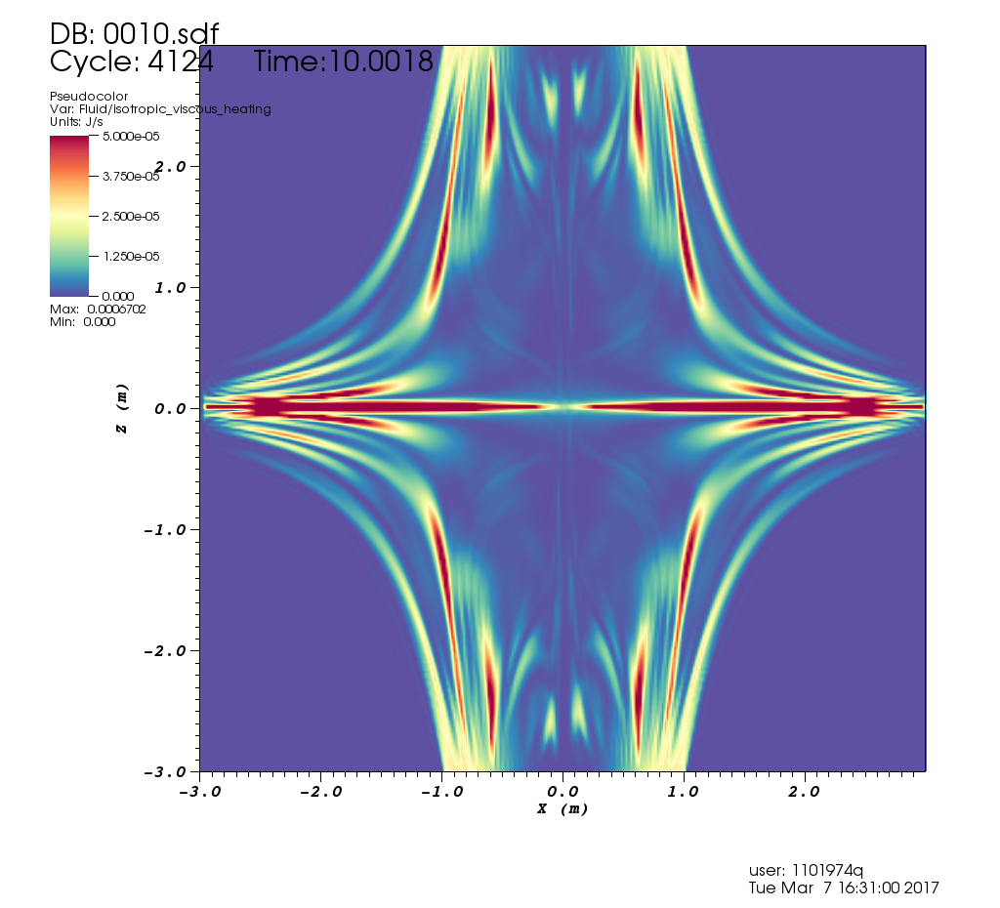

% Anisotropic Viscosity and Astrophysical Applications
% Jamie Quinn
% Supervisor: David MacTaggart

\newcommand{\ten}[1]{\mathbf{#1}}

## MHD

- Momentum Equation ($\frac{D\vec{u}}{Dt} = \cdots$)
- Energy Equation ($\frac{DE}{Dt} = \cdots$)
- Induction Equation ($\frac{D\vec{B}}{Dt} = \cdots$)

## Viscosity

- Measure of internal friction (molecular interactions)
- Produces momentum dissipation
- Produces internal heating

---

Layers of fluid dragged by friction and momentum transported upwards

## Viscosity Stress Tensor

Viscous stress directly proportional to rate of strain.

$\ten{\sigma} = \nu\ten{\varepsilon}$

$\ten{\varepsilon} = \frac{1}{2}\left(\nabla\vec{u} + \nabla\vec{u}^T \right)$

. . .

However magnetic field changes nature of small scale frictional interactions

. . .

Momentum transported better along magnetic field lines than perpendicularly

## Braginskii Viscosity

Kinetic theory -> two fluid model -> one fluid model

. . .

$\begin{align}
\ten{\sigma} = &a(\ten{W}\vec{B}\cdot \vec{B})(\vec{B}\otimes\vec{B}) \\
       &+ b(\ten{W}\vec{B}\cdot\vec{B})I \\
       &+ c(\ten{W}(\vec{B}\otimes\vec{B}) + (\vec{B}\otimes\vec{B})\ten{W}) \\
       &+ d\ten{W}
\end{align}$

$\ten{W}$ analagous to strain rate tensor, only depends on flow velocity

---

In absence of magnetic field, this reduces to isotropic viscosity!

$\ten{\sigma} = d\ten{W} \equiv \nu\ten{\varepsilon}$

. . .

However, in corona, low resolution of null points causes anisotropy to bleed into isotropic areas

## Parallel-Isotropic Switch

- Borrow anisotropic ideas from liquid crystals
- Disregard perpendicular components of viscosity
- Derive parameter that "switches on" parallel anisotropy in strong magnetic field

---

---

## Work So Far

1D Euler equation solver using LAgrangian-REmap scheme

- Lagrangian step solves equations in Lagrangian form, deforming grid
- Remap step maps variables back to Eulerian grid

---

---

{#id .class height=500px}

Initial conditions

---

{#id .class height=500px}

After 350 timesteps (analytic solution in green)

---

Isotropic heating in null point situation using full lare3d code

---

{#id .class height=600px}

---

{#id .class height=600px}

---

{#id .class height=600px}

## Next Steps

- Introduce anisotropic models
- Achieve higher resolution runs
- Apply to different solar phenomena
